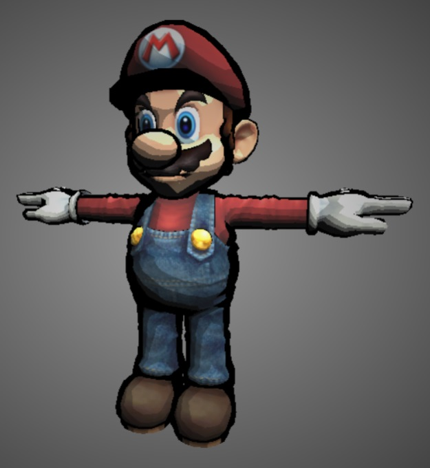
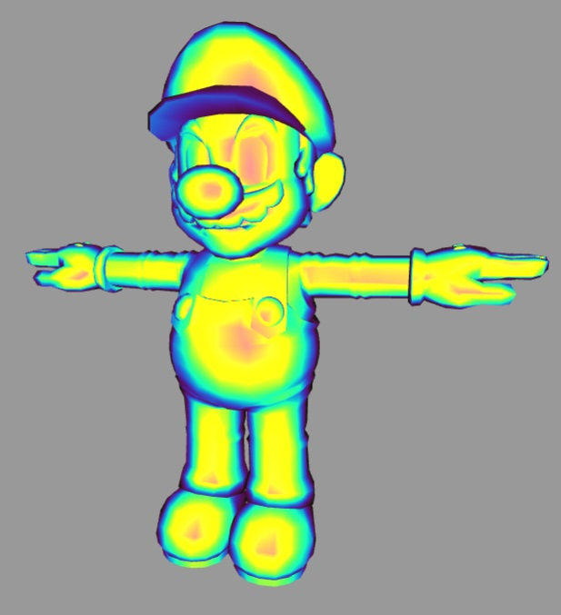
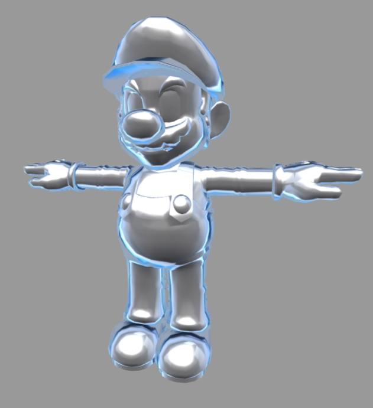
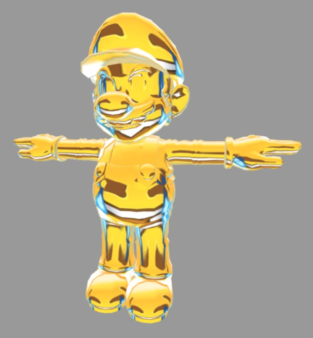
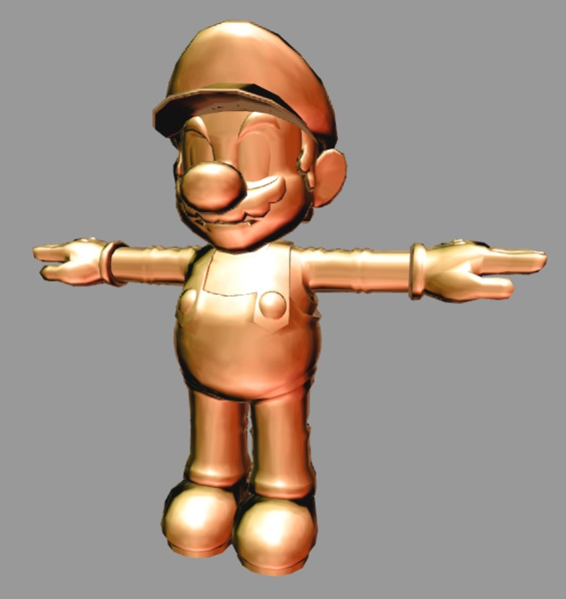
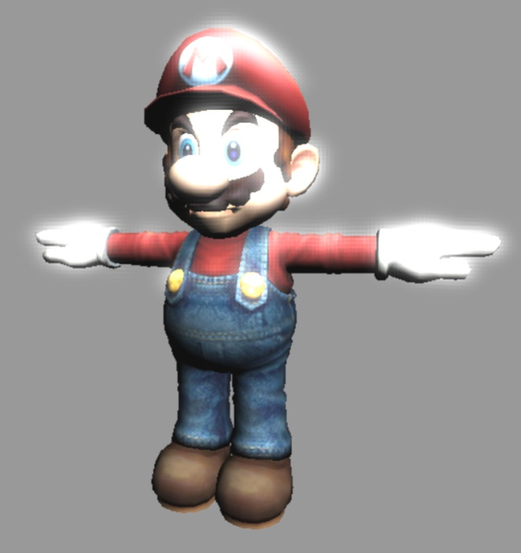

# Project 5: Shaders

Vignette (15)
-------------------------

Iridescence (15)
-------------------------

Lit Sphere (25)
-------------------------
Reference: Spherical Reflection/Environment Mapping
(https://www.clicktorelease.com/blog/creating-spherical-environment-mapping-shader)

Bloom (25)
-------------------------
Gaussian Kernel Calculator: http://dev.theomader.com/gaussian-kernel-calculator/

Gui Features
-------------------------
Change the pixel sampling width for gaussian blur
Change the number of iterations of gaussian blur for X and Y directions to get various blurring effects
Change the threshold for highpass filter
Choose from a list of lit sphere maps
Select the number of buckets for toon shading
For all others, change the amount of the effect, light color and intensity