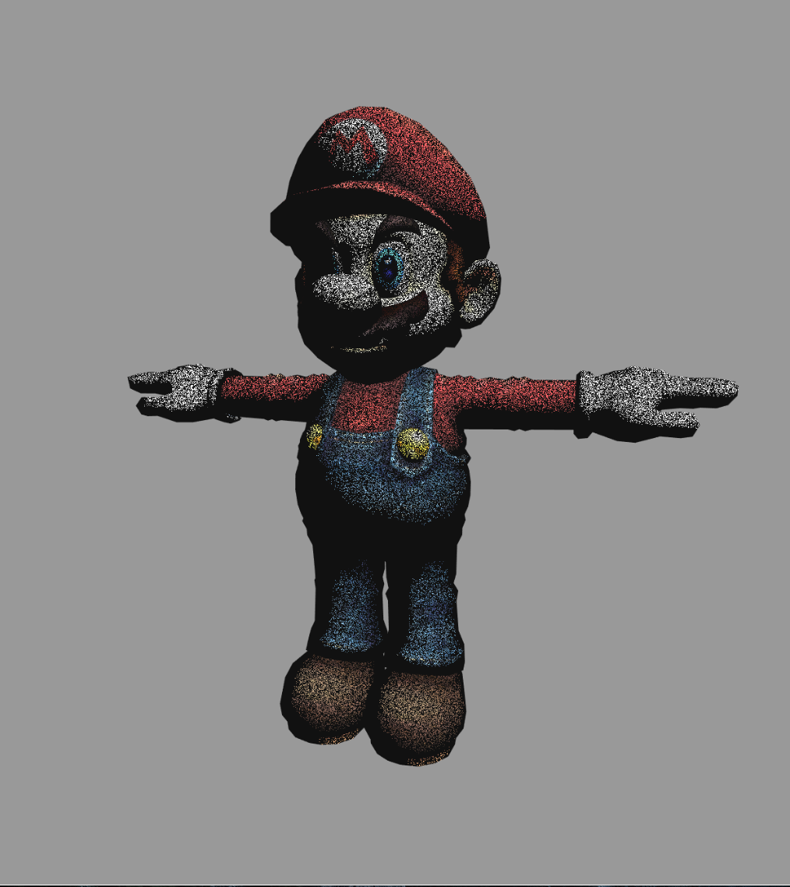
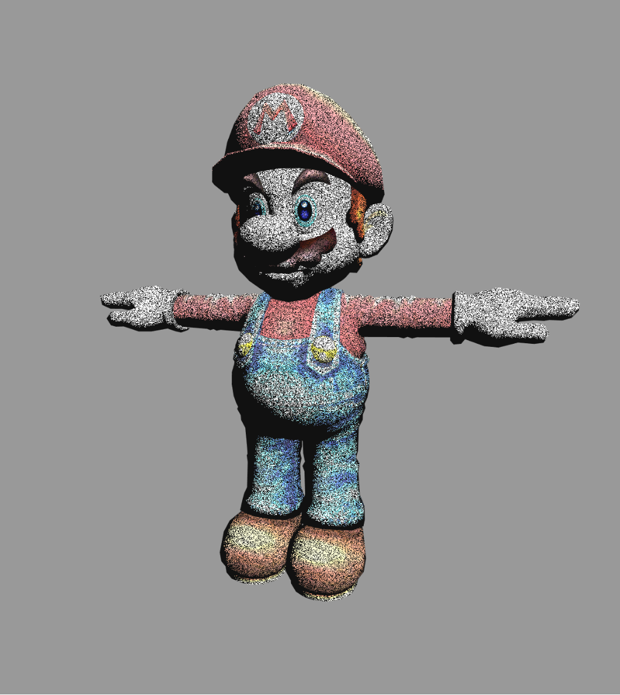
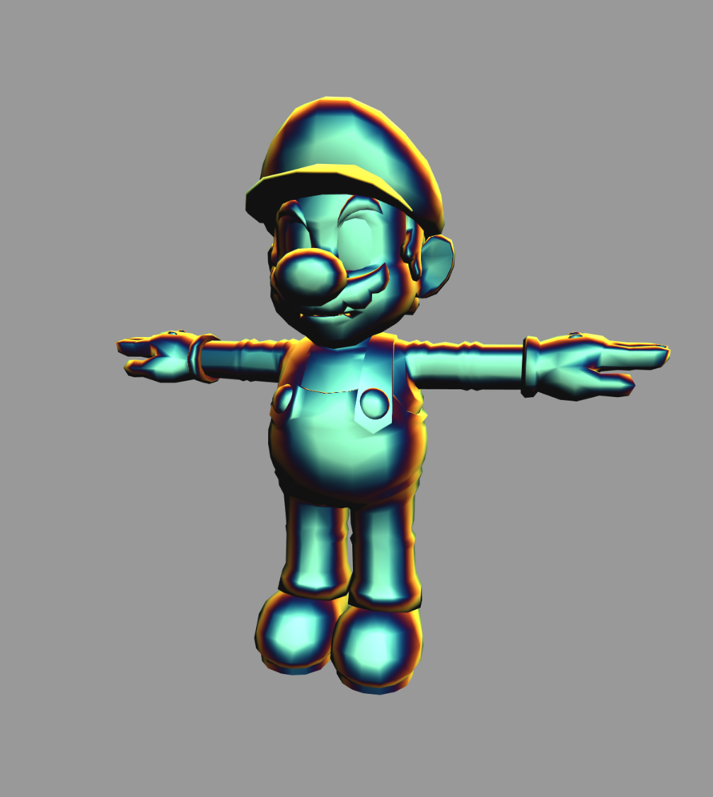
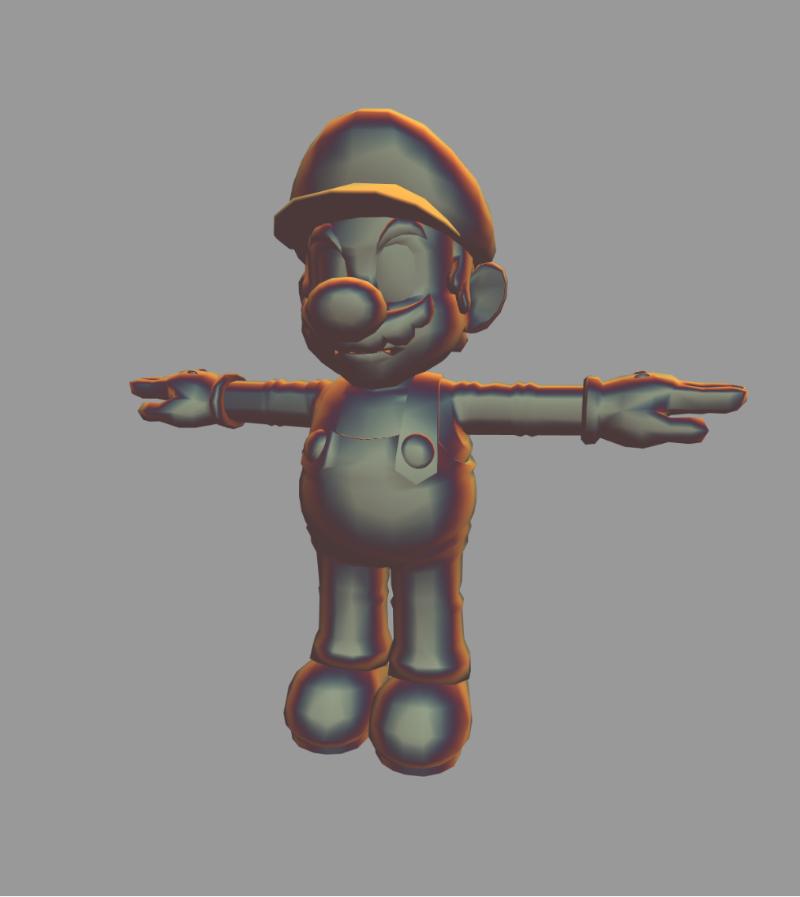
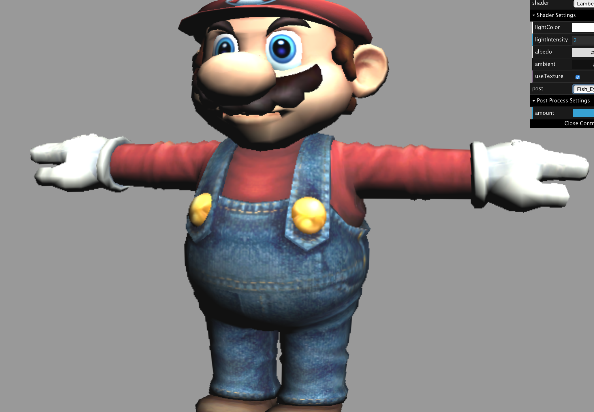
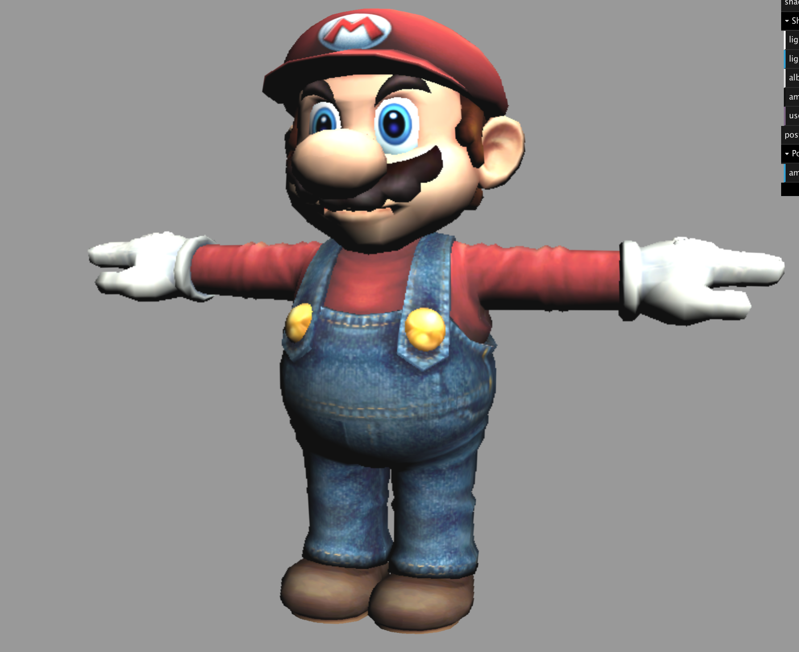
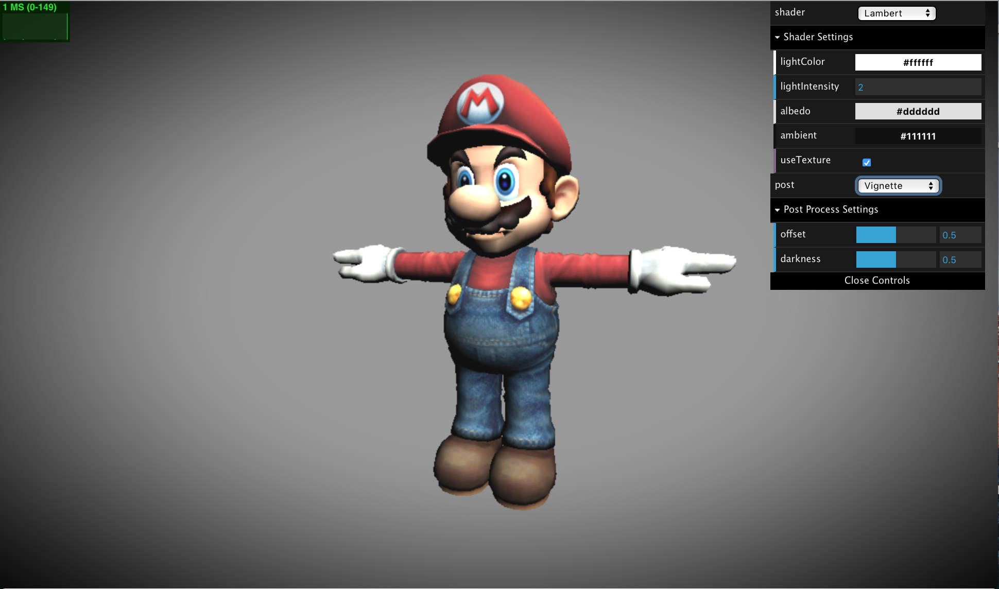
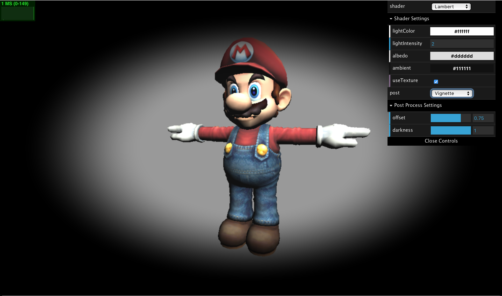
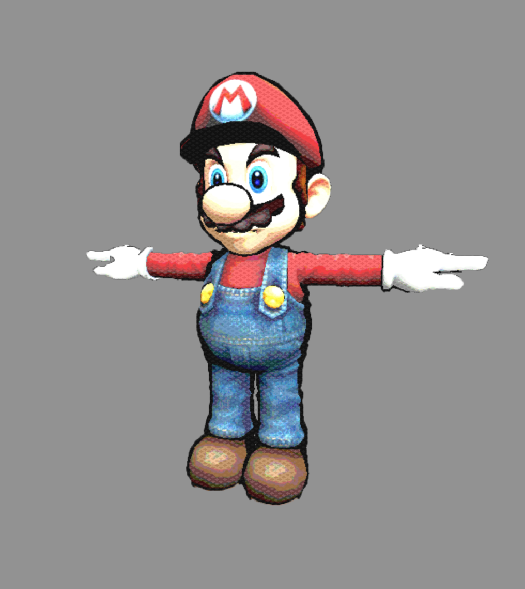
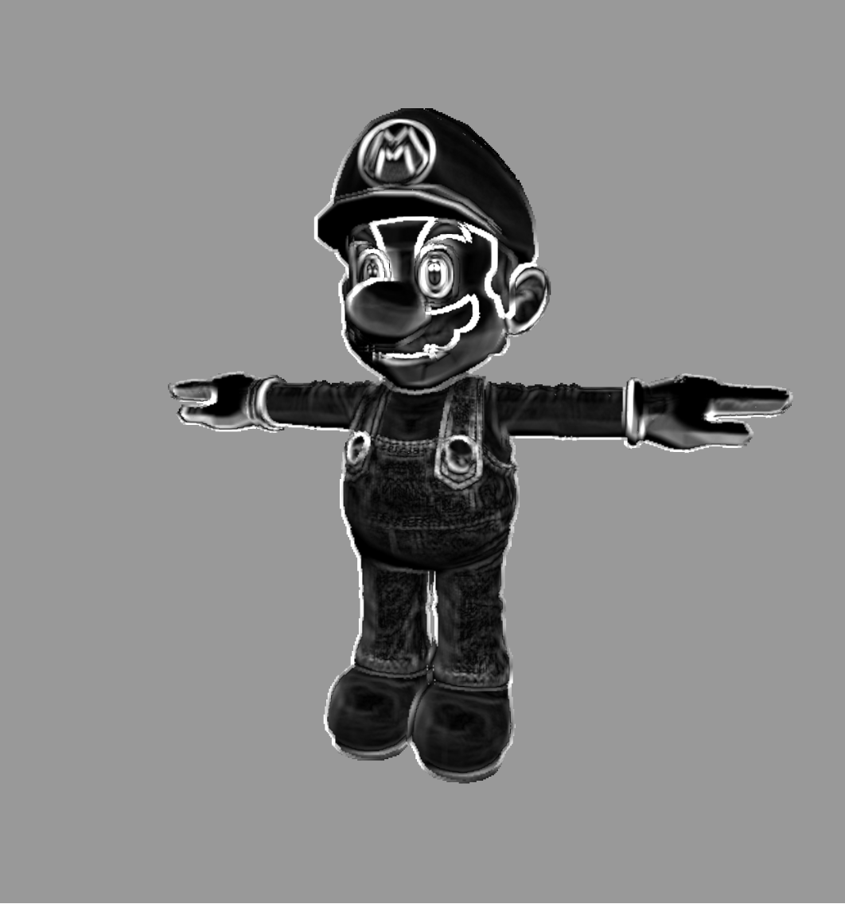

# Project 5: Shaders

## Pointillism
This is what the pointillism shader looks like for different threshold and light intensity values. 
 

 

## Iridescence
This is what the iridescence shader looks like for different light color and light intensity values.
 

 

## Fish-Eye Bulge
This is what the fish-eye bulge shader looks like for different amount values. 
 

 

## Vignette
This is what the vignette shader looks like for different offset and darkness values. 
 

 

## Comic Book
This is what the comic book shader looks like for different amount values. For this shader, I tried to mimic the effect Apple's Photobooth application has. This post- shader creates diamonds on the screen and colors them based on the base color's darkness. If the base color is darker than a certin value, the diamond that covers it is colored a lighter color. If the base color is brighter than a certin value, the diamond that covers it is colored a darker color. If the base color is too dark or too bright, the diamond remains the same color. This effect, in my opinion, goes well over the toon shader.
 

 

## Edge detection with Sobel filtering
This is what the sobel filter shader looks like for different amount values. 
 

 