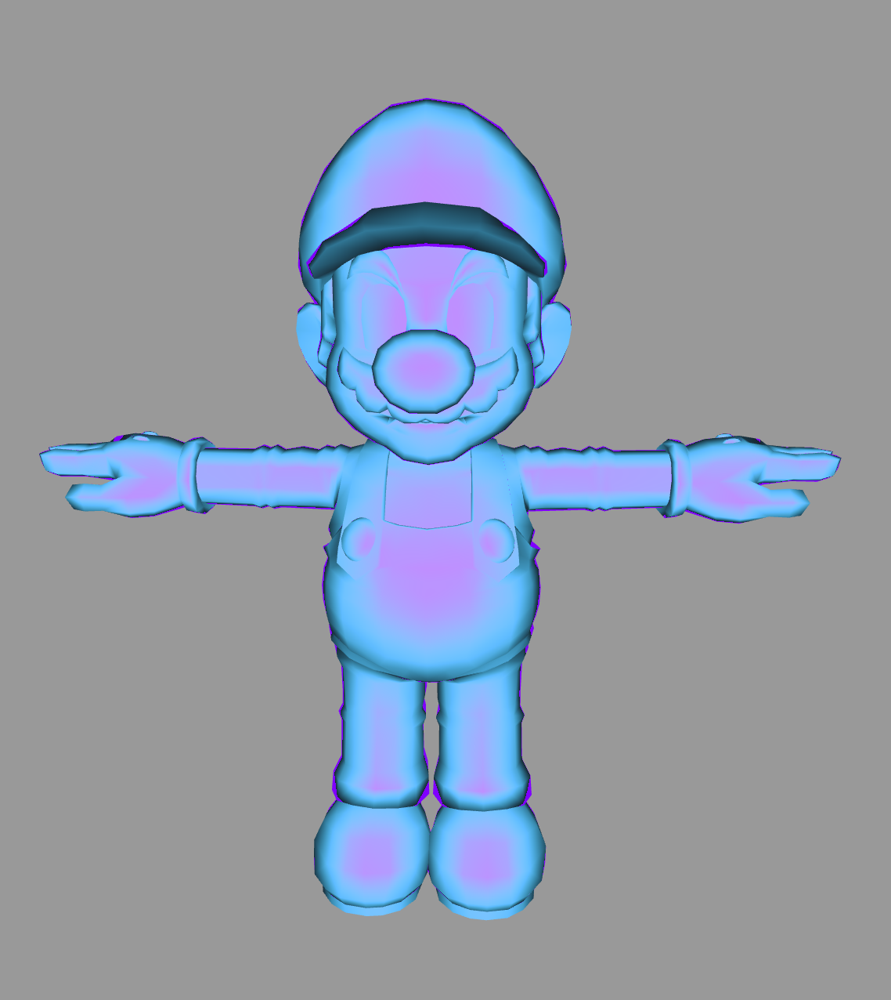
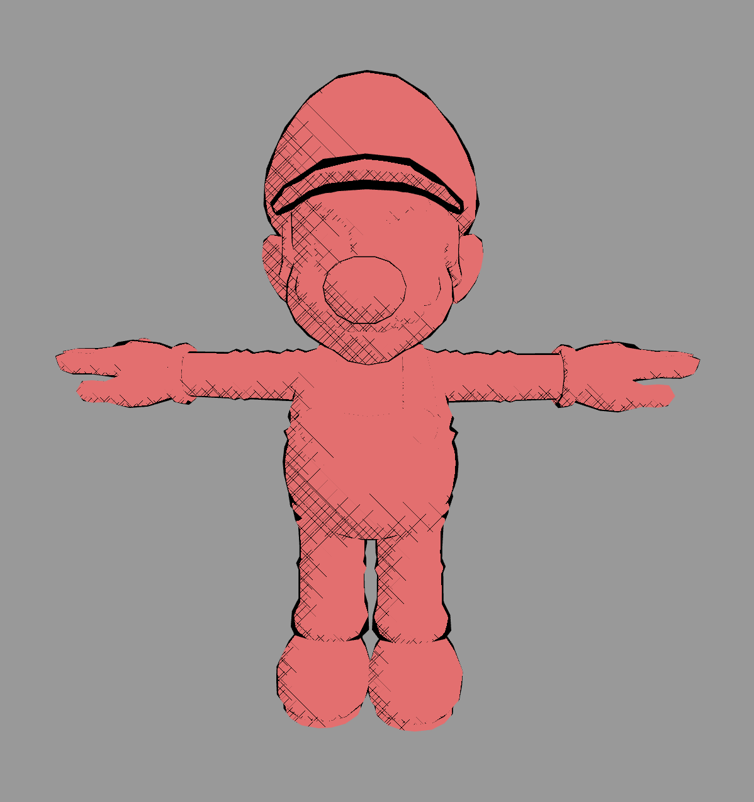
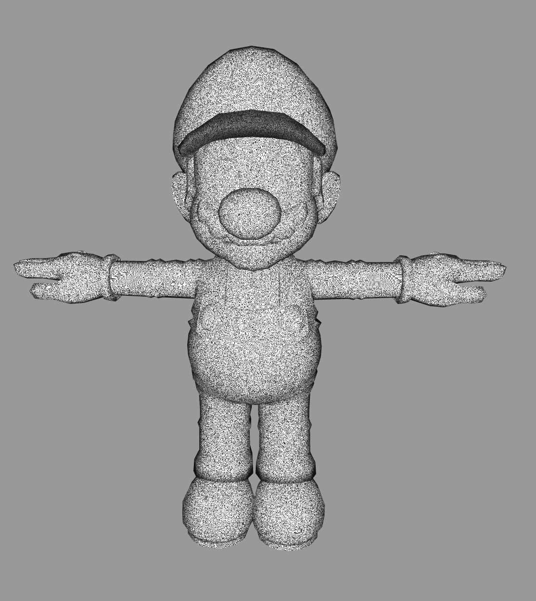
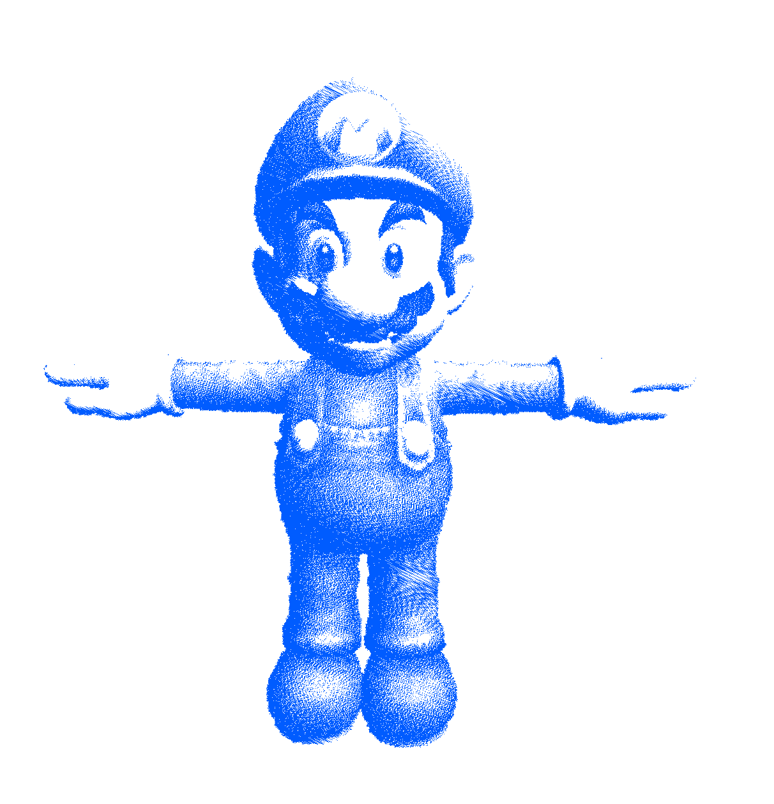
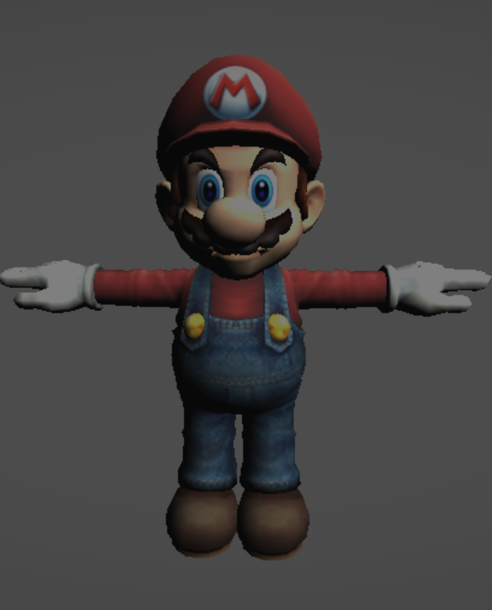
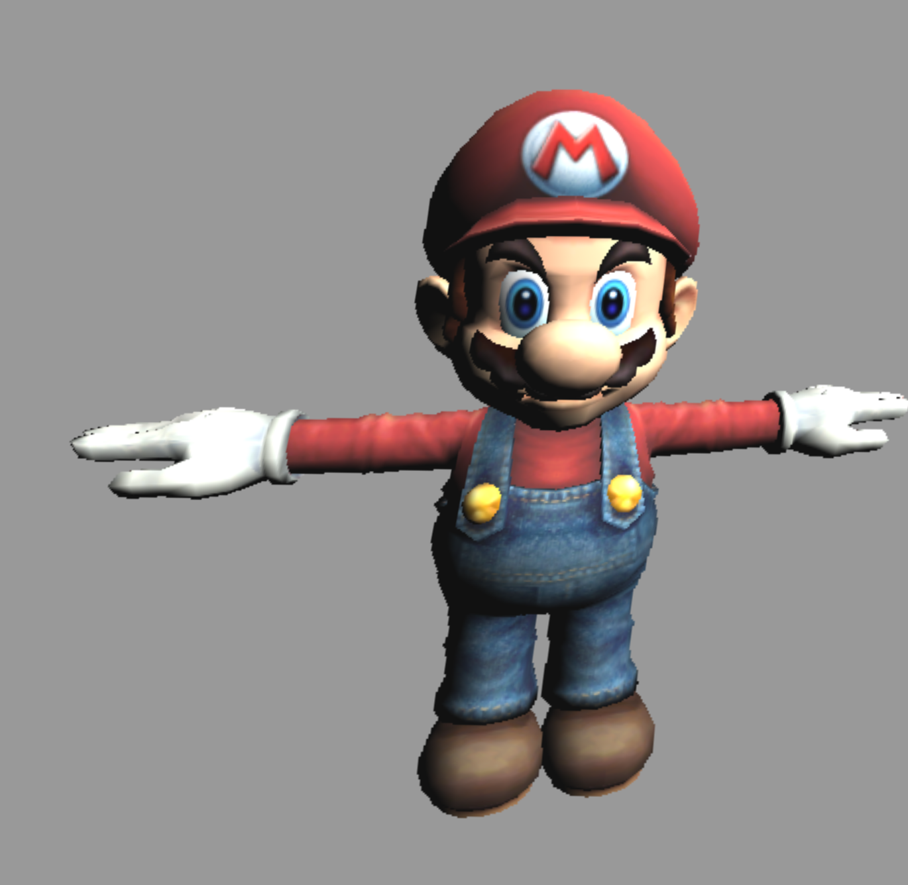

# Project 5: Shaders

[Demo](http://josephgao.me/Project5-Shaders)

* Author: Joseph Gao
* PennKey: gaoj

**Goal:** Create some cool shaders using WebGL.

* DISCLAIMER - I accidentally made Hatching a Shader rather than a Post Shader. I was too lazy to change it (also it's 6AM), but I understand that Cross Hatching is considered a Post rather than a render step.

## 95 points worth of shaders implemented.

## Render Time Shaders

### Iridescence (15 pts)

- My iridescence implementation responds to the lightColor slider as well as the ambient light slider. The shading is done at render time, not in post. The iridescence itself is a default magenta/blue color. I added in a magenta outline as well (in the same way a toon outline is added) because I thought it would look nice!

### Hatching (25 pts)

- As mentioned above, I accidentally implemented my Hatching shader as a render time shader rather than a post render shader. I understand the difference, but on the bright side, the albedo slider works nicely with my hatching shader. The ambient light and light color sliders simply re-adjust how many hatches will appear. The hatching algorithm was borrowed from a unity3D forum (I mixed in some fundamentals from our own slides and attempted to improve on the evenly distributed hatches produced by the method suggested in the class slides by incorporating ideas from the forum). The forum link can be found in the GLSL file!

### Static (??? pts)

- This is my own proposed shader. I was attempting to perform iridescence and accidentally ran into this shader that is based largely on noise. The effect was really cool and reminded me of a antenna TV with no signal, receiving only static, hence the name. I decided this would be the shader we were to submit for the "your own shader" section. 

## Post Render Shaders

### Pointilism (15 pts)

- You are able to modify the amount of points used to draw Mario, as well as the color of the points for some pretty cool effects. The login behind my code is well documented in the GLSL file, and I used a glsl random function that everyone seems to be able to find on Stack Overflow.

### Vignette (15 pts)

- Like my Pointilism shader, you are able to modify both the color and the intensity of the vignette filter. While brighter colors may make the circle harder to see, I promise it is there.

### NoiseWarp (25 pts)

- Okay, I know. It doesn't look as good as the one presented in the demo, and in fact just looks like Mario is vibrating on the X and Y axes indefinitely. The frequency slider does alter the intensity of his vibrations, though! In all seriousness, the most amount of work went into this shader. I first brought back concepts from Project 1 by calculating and interpolating a noise value for each fragment using techniques we have already studied (linear, cosine interpolation), and then I use these noise values to offset the UV coordinates in a way very similar to Mini Minecraft from my CIS 460 days.
