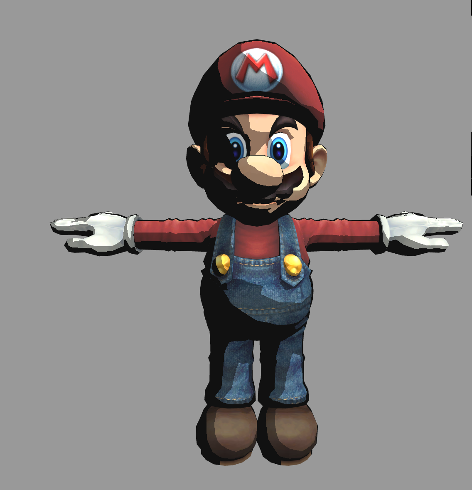
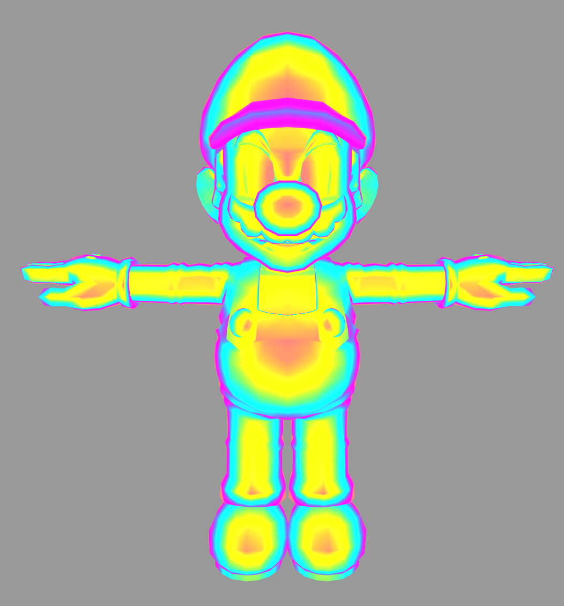
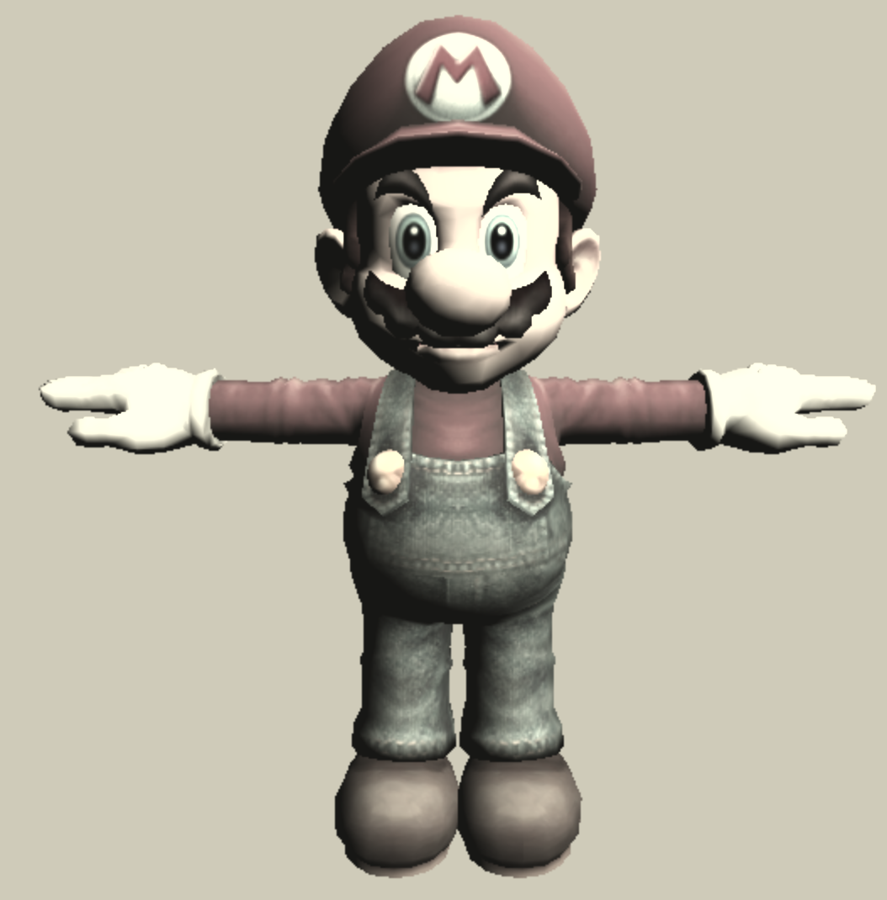
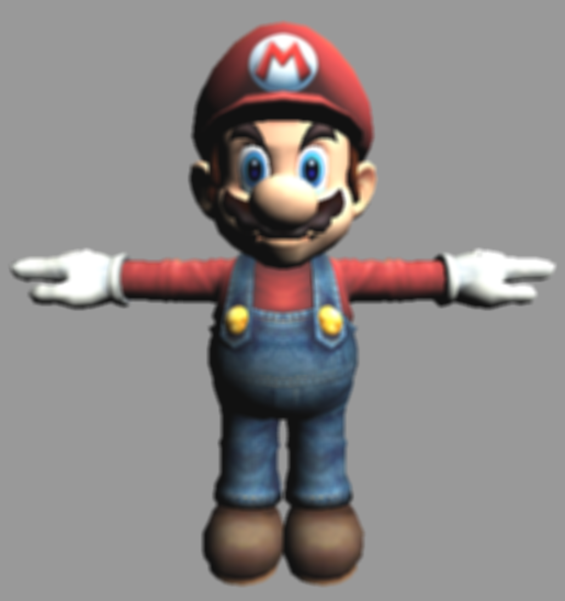
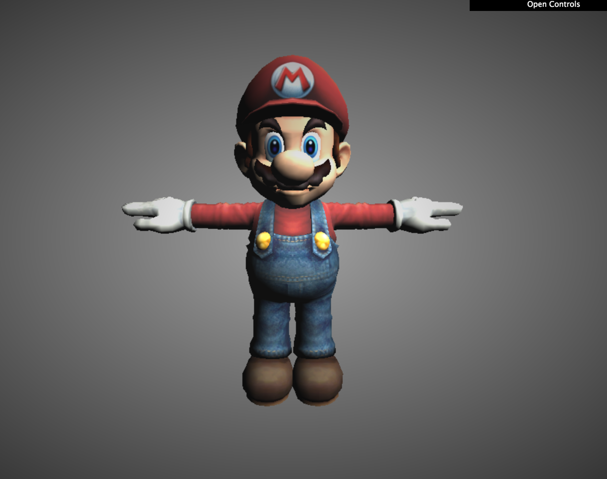
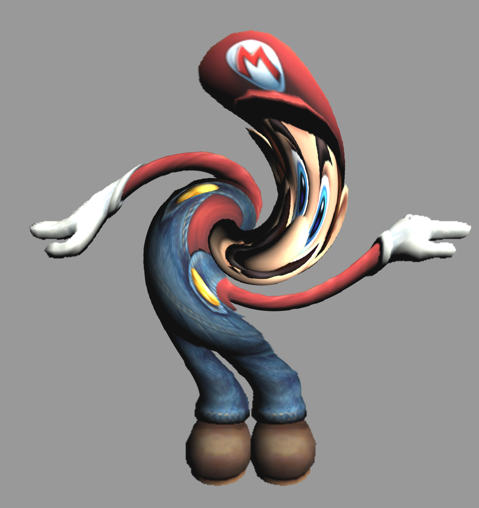
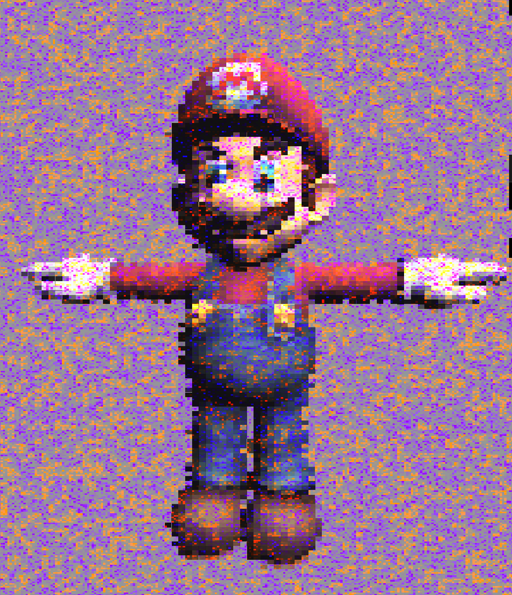

# Project 5: Shaders

__Name: Rudraksha Shah__

__PennID: rdimple__

## Pre-Processing Shaders:

__Toon Shader:__
  Toon shader is basically Lambertian shading with the output colors compartmentalized into bins of colors instead of forming a smooth gradient.

  

__Iridescent Shader:__
  Iridescent shader is in essence like the toon shader the only difference is that instead of mapping into bins of colors the dot product of the view direction and the normal are mapped in a color pallette.

  Reference: Lecture Notes.

  

## Post-Processing Shaders:

__Sepia Shader:__
  One of the classic Instagram filters, Sepia is also another form of color mapping only this time we map the RGB components of the final color with some pre-computed weights. Each RGB value depends on all the other RGB values.

  Reference Source:
  [https://alastaira.wordpress.com/2013/12/02/sepia-shader/](https://alastaira.wordpress.com/2013/12/02/sepia-shader/)

  

__Gaussian Blur Shader:__
  One of the simplest of the blurring effects Gaussian blur is implemented by averaging the surrounding color values for any given pixel to the required depth to create the blur effect.

  Reference Source: Lecture Notes and
  [https://www.shadertoy.com/view/MtlSWj#](https://www.shadertoy.com/view/MtlSWj#)

  

__Vignette Shader:__
  It is a reduction of an image's brightness or saturation at the periphery compared to the image center.

  Reference Source:
  [https://www.shadertoy.com/view/4sB3Rc](https://www.shadertoy.com/view/4sB3Rc)

  

__Spiral Warp Shader;__
  The basic principle behind this effect is to rotate the texture coordinates.

  Manipulate the amount to increase or decrease the swirling effect.

  Reference Source:
  [http://www.geeks3d.com/20110428/shader-library-swirl-post-processing-filter-in-glsl/](http://www.geeks3d.com/20110428/shader-library-swirl-post-processing-filter-in-glsl/)

  

__Pointilism Shader:__
  In this effect we basically represent darkness using density of speckles. I have implemented it as mentioned in the provided reference and applied time values to animate the Mario and the texture.

  Reference Source:
  [https://www.shadertoy.com/view/Xlc3Wr](https://www.shadertoy.com/view/Xlc3Wr)

  
