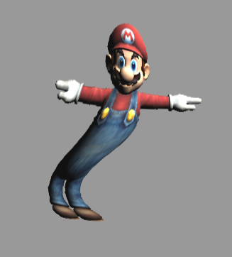

# Project 5: Shaders

For this project I have implemented several shaders, some post-processing. My project can be found at http://tabathah.github.io/Project5-Shaders.

**Bloom:**

My bloom shader adds a post processing pass that in one pass does one iteration of a gaussian blur (with fixed radius of 4 pixels) on the image, taking into account the color only of colors above a certain brightness threshold (which can be adjusted in the gui) and taking black for any others. The "amount" parameter in the gui adjusts the epsilon used to decide how far away to sample the texture to get surrounding color values. Thus, increasing the amount makes the image a bit more trippy. 

For this shader, I referenced https://learnopengl.com/#!Advanced-Lighting/Bloom for a brush up on Gaussian blur, some numbers for weights, as well as a general overview of bloom.

Here are two images, the second has a large value for "amount".

   

**Noise Warp:**

The noise warp warps the image of Mario by offsetting the texture coordinate that is sampled for a given pixel using a noise function. I added a parameter for this shader called "speed", which controls how much the time property, which is passed into the noise function, is incremented every frame. 

The following are some pictures of my warped Mario:

  

**Sobel Edge Detection:**

The sobel shader samples texture colors surrounding the given texture corrdinate and applies a convolution using a certain kernel in the horizontal and vertical directions, which are then combined to give the overall result. For this shader the "radius" parameter controls how far away the surrounding texture samples are taken from the original texture coordinate. Thus, higher radius gives thicker edges for this shader. 

I referenced https://en.wikipedia.org/wiki/Sobel_operator for kernels to use in convolution and a general overview of Sobel edge dectection.

Here are two images, the first with a lower value for "radius" and the second with a higher one.

   

**Emboss:**

This shader was basically done in the same way as Sobel, but with a different kernel. Again I had a "radius" parameter to control how far texture samples were taken from the original texture coordinate.

I used http://setosa.io/ev/image-kernels/ to find a kernel to use for convolution for this shader.

Here are two images, the first with a lower value for "radius" and the second with a higher one.

   

**Pointillism:**

For this shader, I basically computed a probability that a pixel would be colored based on the darkness of its color, found a random value using a noise function, and using that decided whether or not I would color the pixel. I added a parameter in the GUI called "blackWhite", which when 1 makes the pixels which are colored appear black, whereas when it's 0 the pixels which are colored are their own color. I have another parameter called "darkness" that is multiplied by the probability that I compute for the pixel being colored, so that high darkness causes more pixels to be colored and lower darkness causes fewer to be colored.

Here are some images of black and white versus colored pointillism:

 

And some images of low and high darnkess, respectively:

 

